# Clip — Benchmark Comparison

BenchmarkDotNet v0.15.8, macOS Tahoe 26.4.1 (25E253) [Darwin 25.4.0]  
Apple M5, 1 CPU, 10 logical and 10 physical cores  
Run: 2026-04-28 00:58

Clip is a zero-dependency structured logging library for .NET 9. It formats directly into pooled UTF-8 byte buffers — no intermediate strings, no allocations on the hot path, no background-thread tricks to hide latency.

Clip ships two APIs that produce identical output: **Clip** (ergonomic — pass an anonymous object, fields extracted via compiled expression trees) and **ClipZero** (zero-alloc — pass `Field` structs on the stack, nothing touches the heap).

```csharp
// Ergonomic — one anonymous-object allocation, fields cached per type
logger.Info("Request handled",
    new { Method, Status, Elapsed, RequestId, Amount });

// Zero-alloc — stack-allocated structs, zero heap allocations
logger.Info("Request handled",
    new Field("Method", Method),
    new Field("Status", Status),
    new Field("Elapsed", Elapsed),
    new Field("RequestId", ReqId),
    new Field("Amount", Amount));
```

This report puts Clip head-to-head against eight other .NET loggers, all writing to `Stream.Null` so we measure pure formatting cost:

- **Serilog** — rich sink ecosystem and message templates. Allocates a `LogEvent` and boxes value types per call.
- **NLog** — layout renderers give surgical control over output. String-based rendering with per-call allocations.
- **MEL** (Microsoft.Extensions.Logging) — ships with ASP.NET Core. Virtual dispatch, provider iteration, background I/O thread.
- **MELSrcGen** — MEL with `[LoggerMessage]` source generation. Eliminates runtime template parsing and value-type boxing. Same MEL pipeline underneath — this is how Microsoft recommends using MEL in hot paths.
- **ZLogger** — Cysharp's high-performance logger built on MEL. Defers formatting to a background thread — under sustained load, backpressure adds cost on the calling thread.
- **log4net** — the port of Java's Log4j. No structured fields, pattern layouts all the way down.
- **ClipMEL** — Clip behind MEL's `ILogger` via `Clip.Extensions.Logging`. Shows MEL abstraction cost.
- **ZeroLog** — Abc-Arbitrage's zero-allocation logger. Builder API, synchronous mode — measures full formatting cost.

## Feature Matrix

| API & Data Model | Clip | Serilog | NLog | MEL | ZLogger | Log4Net | ZeroLog |
|---------|:---:|:---:|:---:|:---:|:---:|:---:|:---:|
| Structured Fields | ✅ | ✅ | ✅ | ✅ | ✅ | — | ✅ |
| Typed Fields | ✅ | — | — | — | ✅ | — | ✅ |
| Zero-Alloc API | ✅ | — | — | — | ✅ | — | ✅ |
| Message Templates | — | ✅ | ✅ | ✅ | — | — | — |
| Source Generator | — | — | — | ✅ | ✅ | — | — |

| Pipeline | Clip | Serilog | NLog | MEL | ZLogger | Log4Net | ZeroLog |
|---------|:---:|:---:|:---:|:---:|:---:|:---:|:---:|
| Enrichers | ✅ | ✅ | ✅ | — | — | — | — |
| Level-Gated Enrichers | ✅ | ✅ | — | — | — | — | — |
| Filters | ✅ | ✅ | ✅ | ✅ | ✅ | ✅ | — |
| Redactors | ✅ | — | — | — | — | — | — |
| Scoped Context | ✅ | ✅ | ✅ | ✅ | ✅ | — | — |

| Output | Clip | Serilog | NLog | MEL | ZLogger | Log4Net | ZeroLog |
|---------|:---:|:---:|:---:|:---:|:---:|:---:|:---:|
| Console Sink | ✅ | ✅ | ✅ | ✅ | ✅ | ✅ | ✅ |
| JSON Sink | ✅ | ✅ | ✅ | ✅ | ✅ | — | — |
| File Sink | ✅ | ✅ | ✅ | — | ✅ | ✅ | ✅ |
| OpenTelemetry / OTLP | ✅ | ✅ | ✅ | ✅ | — | — | — |

| Architecture | Clip | Serilog | NLog | MEL | ZLogger | Log4Net | ZeroLog |
|---------|:---:|:---:|:---:|:---:|:---:|:---:|:---:|
| Sync-by-Default | ✅ | ✅ | ✅ | — | — | ✅ | — |
| Async / Background | ✅ | ✅ | ✅ | ✅ | ✅ | — | ✅ |
| Buffer Pooling | ✅ | — | ✅ | — | ✅ | — | ✅ |
| Zero Dependencies | ✅ | — | ✅ | — | — | — | — |
| MEL Adapter | ✅ | ✅ | ✅ | — | — | ✅ | — |

| Hardening | Clip | Serilog | NLog | MEL | ZLogger | Log4Net | ZeroLog |
|---------|:---:|:---:|:---:|:---:|:---:|:---:|:---:|
| Strips Control Chars / ANSI | ✅ | — | — | — | — | — | — |
| InnerException Recursion Cap | ✅ 32 | — | ✅ 0¹ | — | — | — | — |
| Per-Entry Size Cap | ✅ 4 MiB | — | — | — | — | — | ✅ 128 B² |
| Async Queue Overflow Policy | DropOldest 1024 | Drop 10k | Discard 10k | Wait 2.5k | Grow ∞³ | — | Drop 1k |
| Sink Failure Isolation | ✅ | ✅ | ⚠️⁴ | ⚠️⁵ | ⚠️⁸ | ⚠️⁶ | ✅ |
| Self-Log Channel | ✅ | ✅ | ✅ | ⚠️⁷ | ⚠️⁸ | ✅ | ⚠️⁹ |
| Reentrancy Guard | ✅ | — | — | — | — | ✅ | — |
| First-Party Redaction | ✅ | — | — | ✅ .NET 8+¹⁰ | — | — | — |
| Compile-Time Analyzers | ✅ 9 rules | 3rd-party | — | ✅ SYSLIB1xxx | — | — | — |


**Hardening notes.** *Hardening* here means: what does the logger do when something in or around a log call goes wrong? An attacker-controlled value with control bytes. A pathological exception graph. A malformed input that explodes a destructor. A sink whose disk just filled up. An enricher that throws. The matrix above tracks nine vectors: input sanitization, exception/recursion bounds, per-entry size cap, async overflow policy, sink-failure isolation, self-log visibility, reentrancy, first-party redaction, and compile-time analyzers.

*Cells with `⚠️` mean the feature exists in some form but has a footnote* *worth reading* — usually a default that turns the protection off, or a scope that doesn't cover the obvious case.

¹ NLog's `MaxInnerExceptionLevel` defaults to `0`, which means inner exceptions are **not rendered at all** by default — a leftover from NLog 1.0 compatibility, not a hardening choice. Set it to a positive value to actually see your inner exceptions.

² ZeroLog's per-entry bound is its zero-alloc fixed buffer (`LogMessageBufferSize`, default 128 bytes). Argument data exceeding it is silently truncated and a `[TRUNCATED]` suffix is appended — this is a design constraint, not a security feature. `Exception.ToString()` is called at format time and is **not** bounded by it.

³ ZLogger's `FullMode = BackgroundBufferFullMode.Grow` is the default, so the queue is **unbounded**: a slow downstream sink will silently grow the buffer until the host OOMs. The bounded modes (`Block`, `DropNewest`, `DropOldest`) must be opted into. Source: [`ZLoggerOptions.cs`](https://github.com/Cysharp/ZLogger/blob/master/src/ZLogger/ZLoggerOptions.cs).

⁴ NLog has no per-target failure isolation. Whether a thrown sink propagates depends on the global `LogManager.ThrowExceptions` flag (default `false`); when `true`, the exception escapes the log call and can take down the caller.

⁵ MEL's `Logger.Log` calls every registered provider, then collects any thrown exceptions and rethrows as `AggregateException` with the message `"An error occurred while writing to logger(s)."` — so the other providers do receive the event, but the application-side log call does not return cleanly. Source: [`Logger.cs`](https://github.com/dotnet/runtime/blob/main/src/libraries/Microsoft.Extensions.Logging/src/Logger.cs).

⁶ log4net's `OnlyOnceErrorHandler` (the default `IErrorHandler` for every appender) logs the **first** exception via `LogLog`, then silently suppresses every subsequent error from the same appender until the appender is recreated. Source: [`OnlyOnceErrorHandler.cs`](https://github.com/apache/logging-log4net/blob/master/src/log4net/Util/OnlyOnceErrorHandler.cs).

⁷ MEL emits its own diagnostics through `LoggingEventSource` (an `EventSource`) — observable via ETW, dotnet-trace, or PerfView, but not a textual self-log channel suitable for ops without that tooling.

⁸ ZLogger's `InternalErrorLogger` (the delegate that receives sink exceptions and internal failures) defaults to `null`. Until you set it, both per-sink failures and self-log events are silently discarded. Source: [`ZLoggerOptions.cs`](https://github.com/Cysharp/ZLogger/blob/master/src/ZLogger/ZLoggerOptions.cs).

⁹ ZeroLog calls `LogManager.ReportInternalError` from its async writer on failure, but does not expose a configurable public channel to receive those reports.

¹⁰ MEL's redaction goes through `Microsoft.Extensions.Compliance.Redaction` paired with `[DataClassification]` attributes on `[LoggerMessage]` parameters (.NET 8+). It only covers the source-generator path — plain `ILogger.LogInformation(...)` extension calls receive no redaction. Source: [`Compliance.Redaction`](https://github.com/dotnet/extensions/blob/main/src/Libraries/Microsoft.Extensions.Compliance.Redaction/README.md).

**Clip's self-log and reentrancy.** Clip's self-log is opt-in via `LoggerConfig.OnInternalError(Action<Exception>)`; until the handler is wired, sink/enricher/filter/redactor exceptions are silently swallowed (the contract is that a log call cannot crash the application). The reentrancy guard is automatic: a log call made from inside a sink, enricher, filter, or redactor on the same thread returns silently rather than recursing.

---

## Filtered

Debug call at Info minimum level — measures the cost of checking the level and returning without doing any work.

```csharp
logger.Debug("This is filtered out");
```

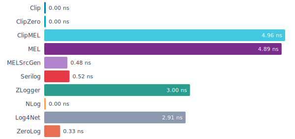

<details>
<summary>Benchmark data</summary>

| Logger | Mean | Error | StdDev | Allocated |
|--------|-----:|------:|-------:|----------:|
| **Clip** | 0.0000 ns | 0.0000 ns | 0.0000 ns | - |
| **ClipZero** | 0.0000 ns | 0.0000 ns | 0.0000 ns | - |
| **ClipMEL** | 4.9647 ns | 0.0094 ns | 0.0176 ns | - |
| MEL | 4.8919 ns | 0.0074 ns | 0.0145 ns | - |
| MELSrcGen | 0.4775 ns | 0.0002 ns | 0.0004 ns | - |
| Serilog | 0.5219 ns | 0.0057 ns | 0.0113 ns | - |
| ZLogger | 3.0037 ns | 0.0013 ns | 0.0026 ns | - |
| NLog | 0.0000 ns | 0.0000 ns | 0.0000 ns | - |
| Log4Net | 2.9125 ns | 0.0004 ns | 0.0008 ns | - |
| ZeroLog | 0.3273 ns | 0.0055 ns | 0.0112 ns | - |

</details>

> **Clip:** Single integer comparison, inlined by the JIT.

<!-- -->

> **ClipMEL:** Clip behind MEL's ILogger interface. The cost here is entirely MEL's own dispatch — MEL's global filter rejects the call before it ever reaches Clip's provider. Matches bare MEL.

<!-- -->

> **MEL:** Virtual dispatch through the `ILogger` interface, then iterates registered providers to check their levels.

<!-- -->

> **MELSrcGen:** Source-generated method checks `ILogger.IsEnabled` before doing any work — same dispatch cost as MEL.

<!-- -->

> **Serilog:** Enum comparison against a mutable level switch. Fast, but the indirection prevents inlining.

<!-- -->

> **ZLogger:** Built on MEL, so pays the same interface-dispatch and provider-iteration cost.

<!-- -->

> **NLog:** Reads a cached boolean flag. Near-zero overhead.

<!-- -->

> **Log4Net:** Walks a parent-child logger hierarchy to resolve the effective level.

<!-- -->

> **ZeroLog:** Checks a cached level flag. Near-zero overhead. Benchmarked via the concrete sealed `ZeroLog.Log` class — ZeroLog does not expose an interface, giving it a small dispatch advantage over loggers benchmarked through interfaces.

<!-- -->

> All loggers check the level and return immediately. No message is formatted, no output is written.

---

## Console

Human-readable text output — the format most developers stare at during local development. Each logger formats a line with timestamp, level, message, and structured fields, then writes to `Stream.Null` so we measure pure formatting cost, not I/O.

Clip's console output:

```
2026-03-19 10:30:45.123 INFO Request handled                           Method=GET Path=/api/users Status=200
2026-03-19 10:30:45.860 ERRO Connection failed                         Host=db.local Port=5432
  System.InvalidOperationException: connection refused
```

This is where architectural choices really show. Clip formats directly into a pooled UTF-8 byte buffer — one pass, no intermediate strings, no garbage. Serilog and NLog allocate event objects and render through layers of abstractions. MEL formats synchronously, then hands a string to a background thread for the actual write — you pay for formatting *and* the handoff. ZLogger punts *everything* to a background thread, so its numbers here only show what it costs to drop a message on a queue — the real work happens later, off the clock.

### Console: No Fields

Message only, no structured fields attached.

```csharp
logger.Info("Request handled");
```

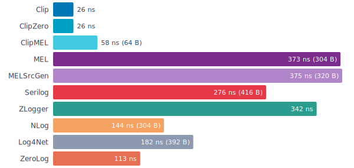

<details>
<summary>Benchmark data</summary>

| Logger | Mean | Error | StdDev | vs Clip | Allocated |
|--------|-----:|------:|-------:|--------:|----------:|
| **Clip** | 27.19 ns | 0.019 ns | 0.033 ns | 1.00 | - |
| **ClipZero** | 27.50 ns | 0.049 ns | 0.095 ns | 1.01 | - |
| **ClipMEL** | 79.17 ns | 0.313 ns | 0.596 ns | 2.91 | 320 B |
| MEL | 372.86 ns | 5.612 ns | 11.337 ns | 13.71 | 304 B |
| MELSrcGen | 375.11 ns | 8.219 ns | 16.603 ns | 13.80 | 320 B |
| Serilog | 276.33 ns | 0.473 ns | 0.945 ns | 10.16 | 416 B |
| ZLogger | 341.99 ns | 0.410 ns | 0.810 ns | 12.58 | - |
| NLog | 143.87 ns | 0.256 ns | 0.518 ns | 5.29 | 304 B |
| Log4Net | 181.89 ns | 0.243 ns | 0.491 ns | 6.69 | 392 B |
| ZeroLog | 113.13 ns | 0.133 ns | 0.266 ns | 4.16 | - |

</details>

> **Clip:** Formats into a pooled byte buffer and writes UTF-8 directly — no intermediate strings. Timestamp is cached so repeated calls within the same millisecond skip reformatting.

<!-- -->

> **ClipMEL:** Clip's formatting engine behind MEL's ILogger. Measures the cost of MEL's abstraction layer on top of Clip.

<!-- -->

> **MEL:** Formats the message synchronously on the calling thread via SimpleConsoleFormatter, then enqueues the formatted string for background I/O. The benchmark captures the full formatting cost.

<!-- -->

> **MELSrcGen:** Source-generated `[LoggerMessage]` method — skips runtime template parsing. Same MEL pipeline (SimpleConsoleFormatter + background I/O) but the generated code is more efficient at the call site.

<!-- -->

> **Serilog:** Allocates a log-event object and parses the message template per call. Output is rendered as strings via a TextWriter, not raw bytes.

<!-- -->

> **ZLogger:** Enqueues the raw state to a background thread — formatting is fully deferred. Under sustained load the background queue fills up, adding backpressure to the calling thread.

<!-- -->

> **NLog:** Allocates a log-event object per call. Output is produced by a chain of layout renderers writing strings.

<!-- -->

> **Log4Net:** Synchronous like Clip. Allocates a log-event object and formats through a pattern layout to strings.

<!-- -->

> **ZeroLog:** Abc-Arbitrage's zero-allocation logger. Running in synchronous mode so the benchmark measures full formatting cost, not just enqueue. Benchmarked via the concrete sealed `ZeroLog.Log` class (no interface available), giving it a small dispatch advantage.

### Console: Five Fields

Message with five structured fields: string, int, double, Guid, and decimal.

```csharp
logger.Info("Request handled", new {
    Method = "GET",
    Status = 200,
    Elapsed = 1.234d,
    RequestId = Guid.Parse("550e8400-e29b-41d4-a716-446655440000"),
    Amount = 49.95m,
});
```

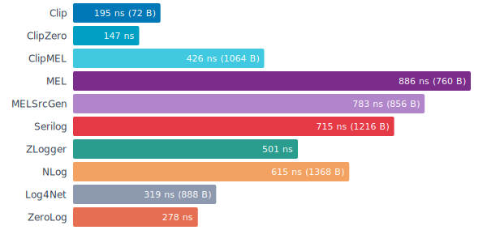

<details>
<summary>Benchmark data</summary>

| Logger | Mean | Error | StdDev | vs Clip | Allocated |
|--------|-----:|------:|-------:|--------:|----------:|
| **Clip** | 194.81 ns | 0.471 ns | 0.931 ns | 1.00 | 72 B |
| **ClipZero** | 147.40 ns | 0.184 ns | 0.341 ns | 0.76 | - |
| **ClipMEL** | 425.85 ns | 1.189 ns | 2.234 ns | 2.19 | 1064 B |
| MEL | 886.08 ns | 3.898 ns | 7.875 ns | 4.55 | 760 B |
| MELSrcGen | 783.41 ns | 5.874 ns | 11.865 ns | 4.02 | 856 B |
| Serilog | 715.36 ns | 2.004 ns | 4.049 ns | 3.67 | 1216 B |
| ZLogger | 500.95 ns | 0.478 ns | 0.955 ns | 2.57 | - |
| NLog | 615.36 ns | 1.444 ns | 2.916 ns | 3.16 | 1368 B |
| Log4Net | 318.79 ns | 0.334 ns | 0.660 ns | 1.64 | 888 B |
| ZeroLog | 278.05 ns | 0.178 ns | 0.356 ns | 1.43 | - |

</details>

> **Clip:** Ergonomic tier allocates one anonymous object (40 B); fields extracted via compiled expression trees (cached per type). Zero-alloc tier passes fields as stack-allocated structs — no boxing, no heap allocation. Both write typed values into the same pooled byte buffer.

<!-- -->

> **ClipMEL:** Same MEL template API as MEL, but formatting is handled by Clip's engine underneath.

<!-- -->

> **MEL:** Formats synchronously, then enqueues for background I/O. Value-type arguments are boxed.

<!-- -->

> **MELSrcGen:** Source-generated — no template parsing, no boxing. Strongly-typed parameters passed directly. Same MEL formatting pipeline underneath.

<!-- -->

> **Serilog:** Each value is wrapped in a property object and value types are boxed. The template is parsed to match placeholders to arguments.

<!-- -->

> **ZLogger:** Background thread — formatting deferred. Interpolated-string handlers avoid boxing but add struct construction overhead. Under sustained load, backpressure from a full queue increases calling-thread cost.

<!-- -->

> **NLog:** Value-type arguments are boxed. Layout renderers write each property as a string.

<!-- -->

> **Log4Net:** Synchronous. Uses printf-style placeholders ({0}) — no named structured fields. Arguments are boxed.

<!-- -->

> **ZeroLog:** Synchronous mode. Fields attached via builder API (AppendKeyValue). Zero heap allocation per call. Benchmarked via concrete sealed class (no interface available).

### Console: With Context

Message inside a logging scope that adds two context fields, plus one call-site field.

```csharp
using (logger.AddContext(new { RequestId = "abc-123", UserId = 42 }))
{
    logger.Info("Processing", new { Step = "auth" });
}
```

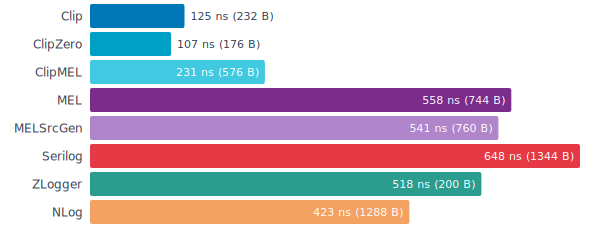

<details>
<summary>Benchmark data</summary>

| Logger | Mean | Error | StdDev | vs Clip | Allocated |
|--------|-----:|------:|-------:|--------:|----------:|
| **Clip** | 134.87 ns | 0.948 ns | 1.781 ns | 1.00 | 232 B |
| **ClipZero** | 115.54 ns | 0.375 ns | 0.723 ns | 0.86 | 176 B |
| **ClipMEL** | 215.23 ns | 3.054 ns | 6.169 ns | 1.60 | 688 B |
| MEL | 557.60 ns | 10.829 ns | 21.875 ns | 4.13 | 744 B |
| MELSrcGen | 540.52 ns | 11.744 ns | 23.723 ns | 4.01 | 760 B |
| Serilog | 648.46 ns | 2.207 ns | 4.458 ns | 4.81 | 1344 B |
| ZLogger | 517.91 ns | 5.842 ns | 11.801 ns | 3.84 | 200 B |
| NLog | 422.64 ns | 0.709 ns | 1.431 ns | 3.13 | 1288 B |

</details>

> **Clip:** Context stored in AsyncLocal<Field[]>. Ergonomic tier allocates an anonymous object for call-site fields; zero-alloc tier passes them as stack-allocated structs. Context and call-site fields merged at write time.

<!-- -->

> **ClipMEL:** Uses MEL's BeginScope, then delegates to Clip's formatting engine.

<!-- -->

> **MEL:** Scope stored on the calling thread, formatted synchronously by SimpleConsoleFormatter. Only the final I/O write is deferred.

<!-- -->

> **MELSrcGen:** Source-generated log call within MEL's BeginScope. No template parsing or boxing for the call-site field. Same scope + formatting pipeline as MEL.

<!-- -->

> **Serilog:** LogContext pushes properties via AsyncLocal. Properties are merged into the event object at construction time.

<!-- -->

> **ZLogger:** Scope stored on the calling thread, formatting deferred to a background thread. The benchmark only measures the calling thread.

<!-- -->

> **NLog:** ScopeContext pushes properties via AsyncLocal. Merged at layout render time.

<!-- -->

> Log4Net and ZeroLog are excluded from context benchmarks — neither has a scoped-context API comparable to Serilog LogContext, NLog ScopeContext, or MEL BeginScope.

### Console: With Exception

Message with an attached exception including a full stack trace.

```csharp
logger.Error("Connection failed", ex, new {
    Host = "db.local",
    Port = 5432,
});
```

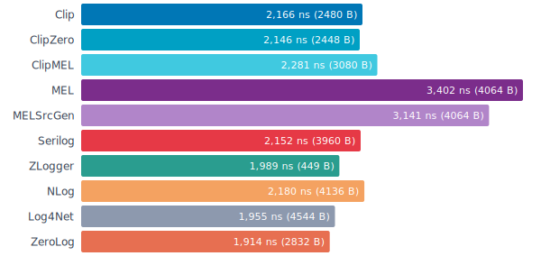

<details>
<summary>Benchmark data</summary>

| Logger | Mean | Error | StdDev | vs Clip | Allocated |
|--------|-----:|------:|-------:|--------:|----------:|
| **Clip** | 2,166.32 ns | 7.282 ns | 14.710 ns | 1.00 | 2480 B |
| **ClipZero** | 2,145.55 ns | 5.523 ns | 10.903 ns | 0.99 | 2448 B |
| **ClipMEL** | 2,280.80 ns | 8.562 ns | 17.099 ns | 1.05 | 3080 B |
| MEL | 3,401.88 ns | 41.472 ns | 83.775 ns | 1.57 | 4064 B |
| MELSrcGen | 3,140.83 ns | 24.142 ns | 48.768 ns | 1.45 | 4064 B |
| Serilog | 2,152.17 ns | 2.143 ns | 4.231 ns | 0.99 | 3960 B |
| ZLogger | 1,988.66 ns | 232.719 ns | 448.371 ns | 0.92 | 449 B |
| NLog | 2,180.38 ns | 2.377 ns | 4.748 ns | 1.01 | 4136 B |
| Log4Net | 1,954.66 ns | 1.415 ns | 2.726 ns | 0.90 | 4544 B |
| ZeroLog | 1,913.81 ns | 3.963 ns | 7.915 ns | 0.88 | 2832 B |

</details>

> **Clip:** Exception rendered synchronously into the same pooled byte buffer.

<!-- -->

> **ClipMEL:** Exception formatted by Clip's engine behind MEL's ILogger interface.

<!-- -->

> **MEL:** Exception formatted synchronously on the calling thread by SimpleConsoleFormatter (including exception.ToString()). Only the final I/O write is deferred to a background thread.

<!-- -->

> **MELSrcGen:** Source-generated — no template parsing or boxing. Exception still formatted synchronously by SimpleConsoleFormatter.

<!-- -->

> **Serilog:** Exception rendered synchronously, appended as a string to the output.

<!-- -->

> **ZLogger:** Exception formatting deferred to a background thread. Under sustained load, backpressure causes high variance and inflated mean times.

<!-- -->

> **NLog:** Exception rendered synchronously via the layout. Full stack trace appended as text after the message.

<!-- -->

> **Log4Net:** Exception rendered synchronously via the layout pattern. Full stack trace appended as text.

<!-- -->

> **ZeroLog:** Synchronous mode. Exception attached via builder. Zero heap allocation per call. Benchmarked via concrete sealed class (no interface available).

<!-- -->

> Exception benchmarks are not directly comparable across loggers — ZLogger defers formatting to a background thread (with backpressure under sustained load) while all others format synchronously.

---

## JSON

Structured JSON — the format that actually goes to production log aggregators. Each logger serializes a JSON object with timestamp, level, message, and fields to `Stream.Null` so we measure serialization cost, not I/O.

Clip's JSON output:

```json
{
  "ts": "2026-03-19T10:30:45.123Z",
  "level": "info",
  "msg": "Request handled",
  "fields": {
    "Method": "GET",
    "Status": 200,
    "Elapsed": 1.234,
    "RequestId": "550e8400-e29b-41d4-a716-446655440000",
    "Amount": 49.95
  }
}
```

Fields are typed — strings are quoted, numbers are bare, exceptions become nested `error` objects with `type`, `msg`, and `stack` fields. No toString() on everything.

JSON serialization is a harder test than console output. You need proper escaping, correct numeric formatting, and structured nesting — not just string concatenation. Clip writes JSON as raw UTF-8 bytes using a Utf8JsonWriter-style approach with SIMD string escaping. Serilog wraps every value in its own property/value object hierarchy before serializing through a TextWriter. NLog renders each attribute individually through its layout engine — strings all the way. ZLogger defers serialization entirely to a background thread. And log4net? It doesn't have a JSON formatter at all — it fakes it with a pattern string shaped like JSON. Structured fields don't even make it into the output.

### JSON: No Fields

Message only, no structured fields attached.

```csharp
logger.Info("Request handled");
```

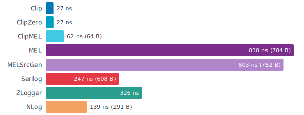

<details>
<summary>Benchmark data</summary>

| Logger | Mean | Error | StdDev | vs Clip | Allocated |
|--------|-----:|------:|-------:|--------:|----------:|
| **Clip** | 27.50 ns | 0.007 ns | 0.012 ns | 1.00 | - |
| **ClipZero** | 31.94 ns | 1.023 ns | 2.043 ns | 1.16 | - |
| **ClipMEL** | 80.60 ns | 0.206 ns | 0.411 ns | 2.93 | 320 B |
| MEL | 837.89 ns | 3.834 ns | 7.656 ns | 30.47 | 784 B |
| MELSrcGen | 802.90 ns | 9.295 ns | 18.777 ns | 29.20 | 752 B |
| Serilog | 247.25 ns | 0.292 ns | 0.589 ns | 8.99 | 608 B |
| ZLogger | 325.55 ns | 7.446 ns | 15.042 ns | 11.84 | - |
| NLog | 138.79 ns | 0.238 ns | 0.476 ns | 5.05 | 291 B |

</details>

> **Clip:** Builds JSON as raw UTF-8 bytes into a pooled buffer. String values are escaped using SIMD.

<!-- -->

> **MEL:** Uses JsonConsoleFormatter. Formats synchronously on the calling thread, then enqueues for background I/O.

<!-- -->

> **MELSrcGen:** Source-generated — no template parsing. Same JsonConsoleFormatter pipeline as MEL.

<!-- -->

> **Serilog:** Serializes through its own object model — each value is wrapped in a property object. Output goes through a TextWriter (strings, not raw bytes).

<!-- -->

> **ZLogger:** Background thread — formatting deferred. Has a real JSON formatter. Under sustained load, backpressure from a full queue increases calling-thread cost.

<!-- -->

> **NLog:** Each JSON attribute is rendered individually through the layout engine. String-based output.

### JSON: Five Fields

Message with five structured fields: string, int, double, Guid, and decimal.

```csharp
logger.Info("Request handled", new {
    Method = "GET",
    Status = 200,
    Elapsed = 1.234d,
    RequestId = Guid.Parse("550e8400-e29b-41d4-a716-446655440000"),
    Amount = 49.95m,
});
```

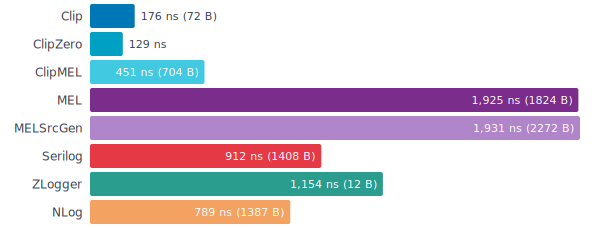

<details>
<summary>Benchmark data</summary>

| Logger | Mean | Error | StdDev | vs Clip | Allocated |
|--------|-----:|------:|-------:|--------:|----------:|
| **Clip** | 185.53 ns | 0.463 ns | 0.926 ns | 1.00 | 72 B |
| **ClipZero** | 133.05 ns | 0.076 ns | 0.141 ns | 0.72 | - |
| **ClipMEL** | 483.39 ns | 0.906 ns | 1.768 ns | 2.61 | 1160 B |
| MEL | 1,924.97 ns | 4.528 ns | 9.043 ns | 10.38 | 1824 B |
| MELSrcGen | 1,931.31 ns | 14.522 ns | 28.323 ns | 10.41 | 2272 B |
| Serilog | 911.76 ns | 0.723 ns | 1.323 ns | 4.91 | 1408 B |
| ZLogger | 1,154.44 ns | 86.505 ns | 170.752 ns | 6.22 | 12 B |
| NLog | 789.35 ns | 0.932 ns | 1.882 ns | 4.25 | 1387 B |

</details>

> **Clip:** Ergonomic tier allocates one anonymous object (40 B); fields extracted via expression trees. Zero-alloc tier passes stack-allocated structs directly. Both write typed JSON values with no boxing and no intermediate strings.

<!-- -->

> **MEL:** Uses JsonConsoleFormatter. Value types are boxed. Formatted synchronously, then enqueued for background I/O.

<!-- -->

> **MELSrcGen:** Source-generated — no template parsing, no boxing. Same JsonConsoleFormatter pipeline as MEL.

<!-- -->

> **Serilog:** Each argument is wrapped in a property object then serialized. Value types are boxed.

<!-- -->

> **ZLogger:** Background thread — formatting deferred. Interpolated-string handlers avoid boxing but add struct construction overhead. Under sustained load, backpressure from a full queue increases calling-thread cost.

<!-- -->

> **NLog:** Event properties are boxed and rendered through the layout engine as strings.

### JSON: With Context

Message inside a logging scope that adds two context fields, plus one call-site field.

```csharp
using (logger.AddContext(new { RequestId = "abc-123", UserId = 42 }))
{
    logger.Info("Processing", new { Step = "auth" });
}
```

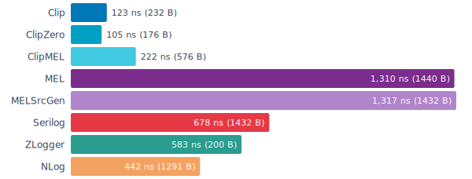

<details>
<summary>Benchmark data</summary>

| Logger | Mean | Error | StdDev | vs Clip | Allocated |
|--------|-----:|------:|-------:|--------:|----------:|
| **Clip** | 123.60 ns | 0.299 ns | 0.576 ns | 1.00 | 232 B |
| **ClipZero** | 106.46 ns | 0.375 ns | 0.732 ns | 0.86 | 176 B |
| **ClipMEL** | 193.46 ns | 0.596 ns | 1.203 ns | 1.57 | 688 B |
| MEL | 1,310.36 ns | 47.158 ns | 95.262 ns | 10.60 | 1440 B |
| MELSrcGen | 1,316.70 ns | 31.368 ns | 63.366 ns | 10.65 | 1432 B |
| Serilog | 677.96 ns | 0.433 ns | 0.854 ns | 5.49 | 1432 B |
| ZLogger | 583.22 ns | 9.744 ns | 19.683 ns | 4.72 | 200 B |
| NLog | 441.53 ns | 0.435 ns | 0.827 ns | 3.57 | 1291 B |

</details>

> **Clip:** Ergonomic tier allocates an anonymous object for call-site fields; zero-alloc tier uses stack-allocated structs. Context and call-site fields merged at write time into the same pooled buffer.

<!-- -->

> **MEL:** Scope stored on the calling thread, formatted synchronously by JsonConsoleFormatter. Only the final I/O write is deferred.

<!-- -->

> **MELSrcGen:** Source-generated log call within MEL's BeginScope. Same JsonConsoleFormatter pipeline as MEL.

<!-- -->

> **Serilog:** Context properties merged into the event object and serialized through the object model.

<!-- -->

> **ZLogger:** Scope stored on the calling thread, rendered on a background thread. The benchmark only measures the calling thread.

<!-- -->

> **NLog:** Scope properties merged and rendered through the layout engine.

<!-- -->

> Log4Net and ZeroLog are excluded from context benchmarks — neither has a scoped-context API comparable to Serilog LogContext, NLog ScopeContext, or MEL BeginScope.

### JSON: With Exception

Message with an attached exception including a full stack trace.

```csharp
logger.Error("Connection failed", ex, new {
    Host = "db.local",
    Port = 5432,
});
```

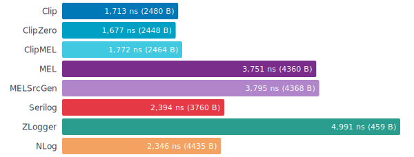

<details>
<summary>Benchmark data</summary>

| Logger | Mean | Error | StdDev | vs Clip | Allocated |
|--------|-----:|------:|-------:|--------:|----------:|
| **Clip** | 2,163.61 ns | 5.005 ns | 9.879 ns | 1.00 | 2480 B |
| **ClipZero** | 2,171.06 ns | 2.324 ns | 4.364 ns | 1.00 | 2448 B |
| **ClipMEL** | 2,303.13 ns | 4.953 ns | 9.892 ns | 1.06 | 3080 B |
| MEL | 3,751.33 ns | 12.818 ns | 24.388 ns | 1.73 | 4360 B |
| MELSrcGen | 3,795.16 ns | 11.699 ns | 21.974 ns | 1.75 | 4368 B |
| Serilog | 2,394.40 ns | 2.720 ns | 5.306 ns | 1.11 | 3760 B |
| ZLogger | 4,991.11 ns | 1,105.786 ns | 2,208.375 ns | 2.31 | 459 B |
| NLog | 2,345.66 ns | 2.618 ns | 5.288 ns | 1.08 | 4435 B |

</details>

> **Clip:** Exception serialized as a structured JSON object synchronously into the pooled buffer.

<!-- -->

> **MEL:** Exception formatted synchronously by JsonConsoleFormatter. Only the final I/O write is deferred.

<!-- -->

> **MELSrcGen:** Source-generated — no template parsing or boxing. Exception still formatted synchronously by JsonConsoleFormatter.

<!-- -->

> **Serilog:** Exception serialized as a string property synchronously.

<!-- -->

> **ZLogger:** Exception formatting deferred to a background thread. Under sustained load, backpressure causes high variance and inflated mean times.

<!-- -->

> **NLog:** Exception serialized as a JSON string attribute synchronously.

<!-- -->

> Exception benchmarks are not directly comparable across loggers — ZLogger defers formatting to a background thread (with backpressure under sustained load) while all others format synchronously.

<!-- -->

> Log4Net and ZeroLog are excluded from JSON benchmarks. Log4Net has no JSON formatter. ZeroLog has no built-in JSON output mode.

---

## Pipeline

Clip processes every log entry through a configurable pipeline before it reaches the sink. Three stages run in order:

- **Enrichers** add fields to every log entry — machine name, service version, request ID. Enricher fields have the lowest priority: context and call-site fields override them on key collision. Each enricher can be level-gated so it only fires at or above a threshold (e.g., skip enrichment for Debug calls).
- **Field filters** remove fields by key before they reach the sink. A filter returning `true` for a key causes that field to be dropped entirely — it never reaches redactors or sinks. Use cases: strip internal-only fields, remove verbose debug-only properties from production output.
- **Redactors** transform field values in place. A redactor receives each field by ref and can replace its value — mask passwords, truncate tokens, scrub PII. Redactors run after filtering, so filtered fields are never redacted.

The pipeline runs synchronously on the calling thread. These benchmarks measure each stage's overhead on a console log call with three fields. All output goes to `Stream.Null`.

### Pipeline: Enriched

An enricher adds one constant field (`app=benchmark`) to every log call. Measures enrichment overhead on top of normal three-field logging.

```csharp
// Clip
var logger = Logger.Create(c => c
    .Enrich.Field("app", "benchmark")
    .WriteTo.Console());
logger.Info("Request handled", new { Method, Status, Elapsed });
```

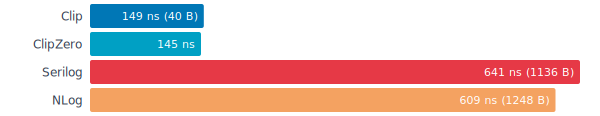

<details>
<summary>Benchmark data</summary>

| Logger | Mean | Error | StdDev | vs Clip | Allocated |
|--------|-----:|------:|-------:|--------:|----------:|
| **Clip** | 154.86 ns | 0.417 ns | 0.813 ns | 1.00 | 40 B |
| **ClipZero** | 153.04 ns | 0.322 ns | 0.644 ns | 0.99 | - |
| Serilog | 641.26 ns | 2.742 ns | 5.150 ns | 4.14 | 1136 B |
| NLog | 609.19 ns | 2.051 ns | 3.801 ns | 3.93 | 1248 B |

</details>

> **Clip:** Enricher configured via `.Enrich.Field("app", "benchmark")`. The field is added to the internal field list on every call. Enricher fields have the lowest priority — call-site and context fields override them on key collision.

<!-- -->

> **Serilog:** Enricher configured via `.Enrich.WithProperty("app", "benchmark")`. The property is added to every `LogEvent` object at construction time. No level gating — the enricher runs on every enabled call.

<!-- -->

> **NLog:** Global property via `GlobalDiagnosticsContext.Set()`, rendered through a `${gdc:item=app}` layout directive. The value is looked up from a concurrent dictionary on each render.

### Pipeline: Field Filtered

A field filter removes fields matching a key. Here a `password` field is passed but filtered out before it reaches the sink.

```csharp
// Clip
var logger = Logger.Create(c => c
    .Filter.Fields("password")
    .WriteTo.Console());
logger.Info("Request handled", new { Method, Status, password = "secret" });
```

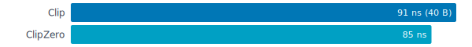

<details>
<summary>Benchmark data</summary>

| Logger | Mean | Error | StdDev | vs Clip | Allocated |
|--------|-----:|------:|-------:|--------:|----------:|
| **Clip** | 94.43 ns | 0.182 ns | 0.347 ns | 1.00 | 40 B |
| **ClipZero** | 93.02 ns | 0.212 ns | 0.424 ns | 0.99 | - |

</details>

> **Clip:** Filter configured via `.Filter.Fields("password")`. Each field key is checked against a hash set. Filtered fields never reach redactors or sinks.

<!-- -->

> Field-level filtering is unique to Clip. Other loggers offer event-level filtering (suppressing entire log entries by level or category) but cannot selectively remove individual fields from an entry.

### Pipeline: Redacted

A redactor replaces field values by key. Here the `Token` field value is replaced with `***` before it reaches the sink.

```csharp
// Clip
var logger = Logger.Create(c => c
    .Redact.Fields("Token")
    .WriteTo.Console());
logger.Info("Request handled", new { Method, Status, Token = "bearer-abc" });
```

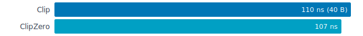

<details>
<summary>Benchmark data</summary>

| Logger | Mean | Error | StdDev | vs Clip | Allocated |
|--------|-----:|------:|-------:|--------:|----------:|
| **Clip** | 110.18 ns | 0.331 ns | 0.646 ns | 1.00 | 40 B |
| **ClipZero** | 106.66 ns | 0.200 ns | 0.381 ns | 0.97 | - |

</details>

> **Clip:** Redactor configured via `.Redact.Fields("Token")`. Each field is checked by key (case-insensitive) and matching values are replaced with `***`. Runs after filtering — filtered fields are never redacted.

<!-- -->

> Runtime field-value redaction is unique to Clip. MEL offers compile-time redaction via a separate package (`Microsoft.Extensions.Compliance.Redaction`) using data classification attributes — a fundamentally different approach.

### Pipeline: Full Pipeline

All three pipeline stages active at once: enricher adds a field, filter removes `password`, redactor replaces `Token` with `***`.

```csharp
var logger = Logger.Create(c => c
    .Enrich.Field("app", "benchmark")
    .Filter.Fields("password")
    .Redact.Fields("Token")
    .WriteTo.Console());
logger.Info("Request handled",
    new { Method, Status, Token = "bearer-abc", password = "secret" });
```

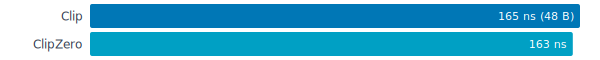

<details>
<summary>Benchmark data</summary>

| Logger | Mean | Error | StdDev | vs Clip | Allocated |
|--------|-----:|------:|-------:|--------:|----------:|
| **Clip** | 173.65 ns | 0.475 ns | 0.892 ns | 1.00 | 48 B |
| **ClipZero** | 171.62 ns | 0.386 ns | 0.753 ns | 0.99 | - |

</details>

> All three pipeline stages active: enricher adds `app=benchmark`, filter removes the `password` field, redactor replaces `Token` with `***`. The pipeline runs in a single pass — enrich, then filter + deduplicate + redact in one loop over the field list.
